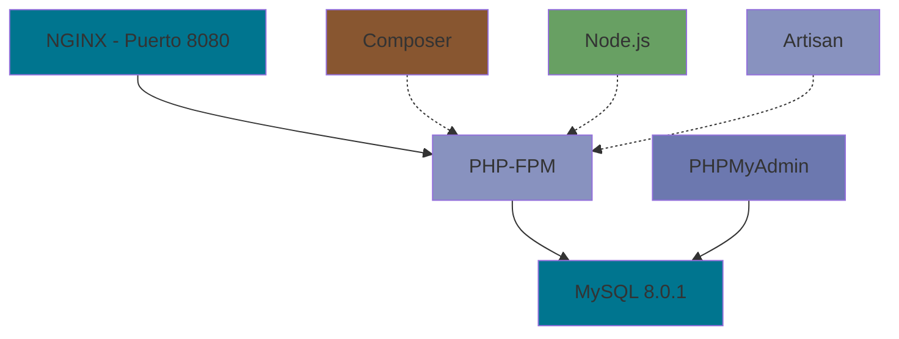

# Entorno Dockerizado para Laravel con Servicios Integrados

Este proyecto proporciona un entorno de desarrollo completo para aplicaciones Laravel, implementando una arquitectura de microservicios con Docker. La configuración está optimizada para el desarrollo moderno con Laravel, incluyendo soporte para Livewire y gestión de assets.

## Arquitectura del Proyecto

El entorno está construido sobre una red Docker dedicada (`laravel_network`) que interconecta los siguientes servicios:

<details>
<summary style="color: #0366d6">🔍 Ver diagrama de servicios</summary>



</details>

## Comandos por Servicio

### Gestión de Contenedores

Para iniciar el entorno completo:
```bash
docker-compose up -d
```

Para detener y eliminar los contenedores:
```bash
docker-compose down
```

### Servidor Web (NGINX)
- Puerto de acceso: `8080`
- Ruta de configuración: `nginx/default.conf`
- Los archivos de la aplicación se sirven desde `src/public`

### PHP y Laravel
Ejecutar comandos de artisan:
```bash
docker-compose run --rm artisan <comando>
```

<details>
<summary style="color: #4a5568">Comandos comunes de Artisan</summary>

- Crear un controlador: `docker-compose run --rm artisan make:controller NombreController`
- Ejecutar migraciones: `docker-compose run --rm artisan migrate`
- Limpiar caché: `docker-compose run --rm artisan cache:clear`
- Generar key: `docker-compose run --rm artisan key:generate`

</details>

### Composer
Gestión de dependencias PHP:
```bash
docker-compose run --rm composer <comando>
```

<details>
<summary style="color: #805ad5">Operaciones frecuentes con Composer</summary>

- Instalar dependencias: `docker-compose run --rm composer install`
- Actualizar dependencias: `docker-compose run --rm composer update`
- Agregar paquete: `docker-compose run --rm composer require vendor/package`
- Autoload: `docker-compose run --rm composer dump-autoload`

</details>

### Base de Datos (MySQL)
- Puerto expuesto en el host: `3308` (mapeado al puerto `3306` dentro del contenedor)
- Persistencia: Directorio `mysql_data/`
- Acceso a través de PHPMyAdmin: `http://localhost:8090`

<details>
<summary style="color: #dd6b20">Acceso directo a MySQL</summary>

```bash
docker-compose exec mysql mysql -u root -p
```
Las credenciales se configuran en `mysql/.env`

</details>

### Node.js y NPM
Gestión de assets y dependencias frontend:
```bash
docker-compose run --rm node <comando>
```

<details>
<summary style="color: #68A063">Comandos para desarrollo frontend</summary>

- Instalar dependencias: `docker-compose run --rm node install`
- Desarrollo con hot-reload: `docker-compose run --rm node run dev`
- Compilar para producción: `docker-compose run --rm node run build`
- Vigilar cambios: `docker-compose run --rm node run watch`

</details>

## Consideraciones de Desarrollo

- Los cambios en los archivos del proyecto son sincronizados automáticamente gracias a los volúmenes de Docker
- La configuración de NGINX está optimizada para Laravel y maneja correctamente las rutas amigables
- Los contenedores de Composer y Node están configurados como servicios temporales para optimizar recursos
- La base de datos persiste entre reinicios gracias al volumen `mysql_data`

<details>
<summary style="color: #2b6cb0">Consejos de Rendimiento</summary>

1. El flag `:delegated` en los volúmenes de PHP mejora el rendimiento en sistemas macOS
2. La red Docker está configurada para optimizar la comunicación entre servicios
3. Los contenedores temporales se eliminan automáticamente tras su uso con el flag `--rm`
4. La caché de Composer se mantiene entre ejecuciones

</details>

## Personalización

El entorno puede ser extendido modificando los Dockerfiles en el directorio `dockerfiles/` o ajustando la configuración en `docker-compose.yml`. Cada servicio está modularizado para facilitar su personalización sin afectar al resto del sistema.